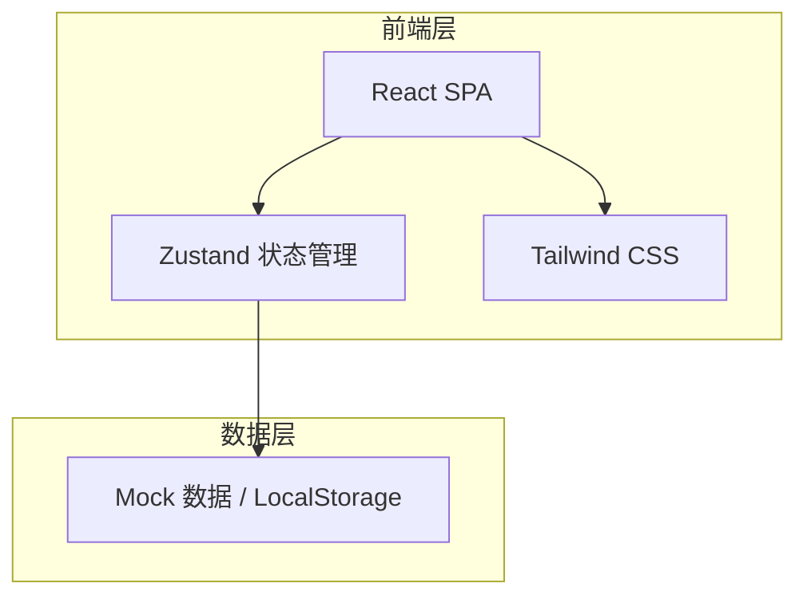
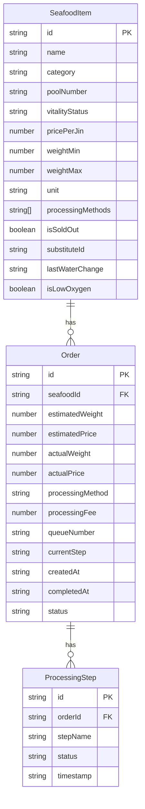

# 海鲜市集活鲜价牌与预订系统 - 技术架构文档

## 1. 架构设计



纯前端项目，使用 Mock 数据模拟后端，LocalStorage 持久化订单和状态数据。

## 2. 技术说明
- 前端: React@18 + TypeScript + Tailwind CSS@3 + Vite
- 状态管理: Zustand
- 路由: react-router-dom@7
- 图标: lucide-react
- 后端: 无（纯前端 Mock）
- 数据持久化: LocalStorage

## 3. 路由定义
| 路由 | 用途 |
|------|------|
| `/` | 活鲜池展示页（自动检测设备类型） |
| `/seafood/:id` | 活鲜详情页 |
| `/order/:id` | 预订与取餐跟踪页 |
| `/staff` | 员工管理面板 |
| `/board` | 大屏价牌模式 |

## 4. 数据模型

### 4.1 数据模型定义



### 4.2 数据定义

核心 TypeScript 类型：

```typescript
interface SeafoodItem {
  id: string;
  name: string;
  category: string;
  poolNumber: string;
  vitalityStatus: 'alive' | 'weak' | 'dead' | 'low_oxygen';
  pricePerJin: number;
  weightMin: number;
  weightMax: number;
  unit: string;
  processingMethods: ProcessingMethod[];
  isSoldOut: boolean;
  substituteId?: string;
  lastWaterChange: string;
  isLowOxygen: boolean;
  image?: string;
}

interface ProcessingMethod {
  id: string;
  name: string;
  fee: number;
  estimatedMinutes: number;
}

interface Order {
  id: string;
  seafoodId: string;
  estimatedWeight: number;
  estimatedPrice: number;
  actualWeight?: number;
  actualPrice?: number;
  processingMethod: string;
  processingFee: number;
  queueNumber: string;
  currentStep: ProcessingStepName;
  createdAt: string;
  completedAt?: string;
  status: 'pending' | 'processing' | 'ready' | 'completed' | 'cancelled';
}

type ProcessingStepName = 'weighing' | 'slaughtering' | 'cooking' | 'packing' | 'pickup';

interface ProcessingStep {
  id: string;
  orderId: string;
  stepName: ProcessingStepName;
  status: 'pending' | 'in_progress' | 'completed';
  timestamp?: string;
}
```

## 5. 目录结构

```
src/
  components/
    seafood/
      SeafoodCard.tsx        # 活鲜卡片
      SeafoodGrid.tsx        # 活鲜网格展示
      VitalityIndicator.tsx  # 鲜活状态指示灯
      SoldOutOverlay.tsx     # 售罄遮罩
    order/
      OrderCard.tsx          # 订单卡片
      ProcessingProgress.tsx # 加工进度条
      WeighingRecord.tsx     # 称重记录
      QueueDisplay.tsx       # 排队号显示
    staff/
      StaffPanel.tsx         # 员工面板
      WeighingInput.tsx      # 称重录入
      StepUpdateButtons.tsx  # 步骤更新按钮
      PoolStatusManager.tsx  # 池状态管理
    shared/
      PriceDisplay.tsx       # 价格显示组件（含预估提示）
      DeviceDetector.tsx     # 设备类型检测
      BgDecoration.tsx       # 背景装饰
      NavBar.tsx             # 导航栏
      TabBar.tsx             # 底部Tab栏（手机端）
  hooks/
    useDeviceType.ts         # 设备类型检测Hook
    useSeafoodStore.ts       # 活鲜数据Store
    useOrderStore.ts         # 订单数据Store
  pages/
    Home.tsx                 # 活鲜池展示页
    SeafoodDetail.tsx        # 活鲜详情页
    OrderTrack.tsx           # 预订取餐跟踪页
    StaffDashboard.tsx       # 员工管理面板
    BoardView.tsx            # 大屏价牌视图
  lib/
    utils.ts
    mockData.ts              # Mock数据
  App.tsx
  main.tsx
  index.css
```
